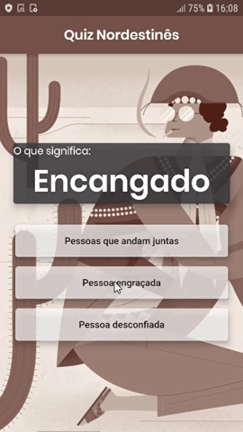
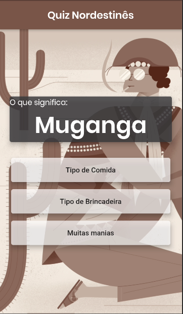
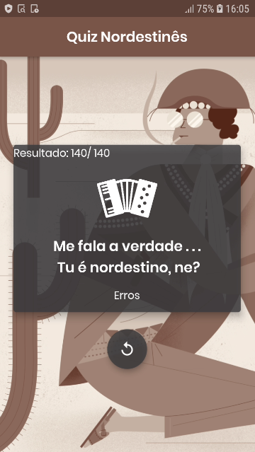
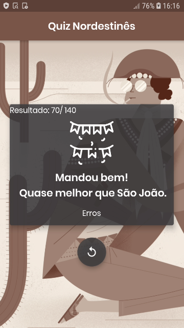

# Quiz Nortestinês

Aplicação feita em Flutter para implementar meus estudos.

Será que você conhece todas as expressões Nordestinas? O quiz Nordestinês foi feito para testar seus conhecimentos sobre as expressões mais utilizadas no Nordeste brasileiro.

O app é composto por 15 perguntas e sua pontuação pode variar de 0 a 140, de acordo com seus acertos.
Ao final é possível conferir sua pontuação, seus erros e um exemplo de como utilizar cada palavra. 

# Screenshots

 

 

## Assuntos Estudados:
- Widgets básicos
    - Scaffold
    - Text
    - buttons
    - Card 
    - Container
    - Column
    - ListView.builder

- Assets
    - Imagens
    - Fontes externas

- Lógica de programação

## Getting Started

This project is a starting point for a Flutter application.

A few resources to get you started if this is your first Flutter project:

- [Lab: Write your first Flutter app](https://flutter.dev/docs/get-started/codelab)
- [Cookbook: Useful Flutter samples](https://flutter.dev/docs/cookbook)

For help getting started with Flutter, view our
[online documentation](https://flutter.dev/docs), which offers tutorials,
samples, guidance on mobile development, and a full API reference.
